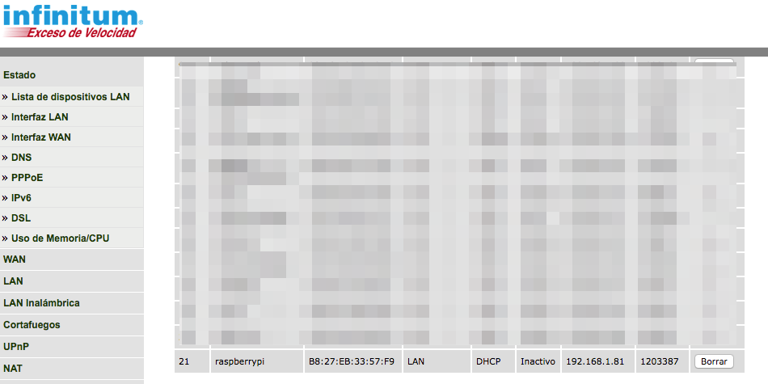
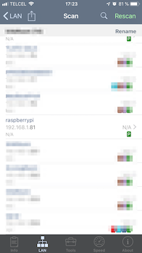

# Raspberry Pi BootUp

## Raspbian Stretch Lite 

Initial Configuration
Make sure to connect:
* Monitor
* USB Keyboard
* USB Mouse (Optional)
* Ethernet Cable
* micro USB power adapter

**For Headless Set Up**
Make sure to connect:
* Ethernet Cable
* micro USB power adapter

## Login

**username:** pi
**password:** raspberry

## Enable SSH
### Headless Configuration
Create the file ssh in the bootable SD
* In macOS - connect to a Terminal Window.
* Cd into the Bootable SD and create a file named ssh with no extension and no contents.
```bash
# cd into the SD Card
cd /Volumes/boot 
ls
# Create the ssh file
touch ssh
ls
```

## Locate the IP Address
* Use a Phone software such as Net Analyzer to scan your LAN.
* Check the Home Router devices table and locate the IP address of `raspberry`.





## Login to the pi
In macOS open a terminal Window and SSH the raspberry by using the IP address Found Before.

```console
<!-- ssh -p pi@[ip address] -->
ssh -p pi@192.168.1.81

<!--  -->
 $ ssh -p 22 pi@192.168.1.81
The authenticity of host '192.168.1.81 (192.168.1.81)' can't be established.
ECDSA key fingerprint is SHA256:o55O8FBimuttn/zNQ82uz7XasCx6EA/jLa1LyBx88Z.
Are you sure you want to continue connecting (yes/no)? yes

<!-- **username:** pi -->
<!-- **password:** raspberry -->

<!-- In case you have problems edit the known_host file and remove the hostname line-->
<!-- vim /Users/[username]/.ssh/known_hosts -->
```

# Initial Configuration
## Start Raspberry-Pi configuration program.
```console
sudo raspi-config
```
## Fix LOCALE Issue
Add export LC_ALL=C to the .profile
```console
cd ~
vi .profile
export LC_ALL=C
source .profile
```

## Change the Hostname
Change the name to whatever you like, but only use the letters 'a' to 'z' (upper or lower), digits '0' to '9', and the dash '-'.

```console
<!-- Rename you Pi by editing the file  /etc/hostname-->
sudo vi /etc/hostname
<!--  Edit the name in /etc/hosts-->
sudo vi /etc/hosts

127.0.1.1       [pi-name]
```

## Update the Pi
```console
sudo apt-get update
sudo apt-get upgrade
```

## Install Software
```console
sudo apt-get install vim  -y
sudo apt-get install -y zip unzip
sudo apt-get install -y tree
sudo apt-get install git -y
sudo apt-get install python3-pip -y
sudo apt-get install supervisor -y
sudo apt-get install nginx -y
sudo apt-get install mysql-server -y
sudo apt-get install postgresql libpq-dev  postgresql-client postgresql-client-common -y
sudo apt-get install nodejs -y

sudo pip3 install --upgrade pip

sudo pip3 install virtualenv
sudo pip3 install virtualenvwrapper

<!-- virtualenvwrapper.sh location -->
<!-- /usr/local/bin/virtualenvwrapper.sh -->

```

```bash
# VIRTUALENVWRAPPER CONFIGURATION
# Update with the location of the virtualenvwrapper.sh Path.
VIRTUALENVWRAPPER_SH_PATH="/usr/local/bin/virtualenvwrapper.sh"
# set where virutal environments will live
export WORKON_HOME=$HOME/.virtualenvs
# ensure all new environments are isolated from the site-packages directory
export VIRTUALENVWRAPPER_VIRTUALENV_ARGS='--no-site-packages'
# use the same directory for virtualenvs as virtualenvwrapper
export PIP_VIRTUALENV_BASE=$WORKON_HOME
# makes pip detect an active virtualenv and install to it
export PIP_RESPECT_VIRTUALENV=true
if [[ -r ${VIRTUALENVWRAPPER_SH_PATH} ]]; then
    source ${VIRTUALENVWRAPPER_SH_PATH}
else
    echo "WARNING: Can't find virtualenvwrapper.sh"
fi
```


 [Postgresql](https://opensource.com/article/17/10/set-postgres-database-your-raspberry-pi)

# Checklist

1. Create the Bootable SD with Etcher
2. Enable SSH by adding ss file in the bootable SD
3. Locate The IP Address
4. SSH to the IP Address
5. Change the hostname.
6. Change pi passowrd
7. Install Packages
8. Configure Packages
    1. Configure virtualenvwarpper
        1. /usr/local/bin/virtualenvwrapper.sh
        2. .profile
    2. Configure MySQL
    3. Configure postgresql. 
9. None
