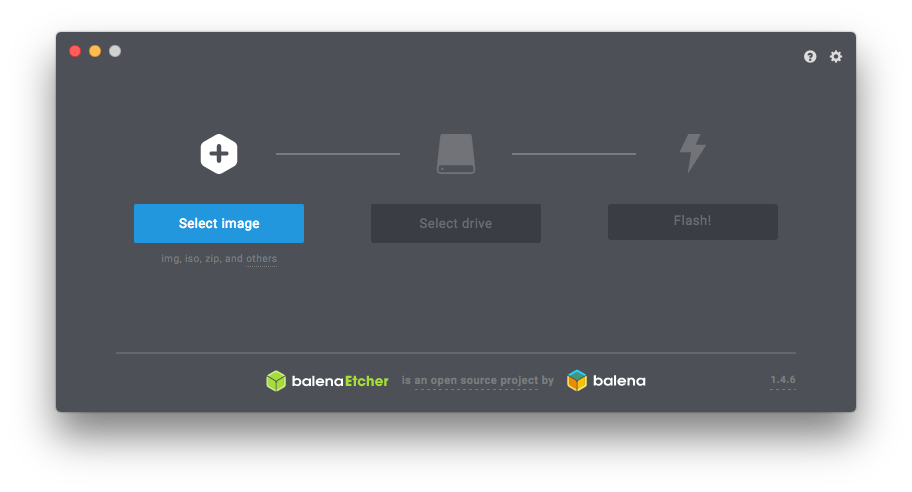
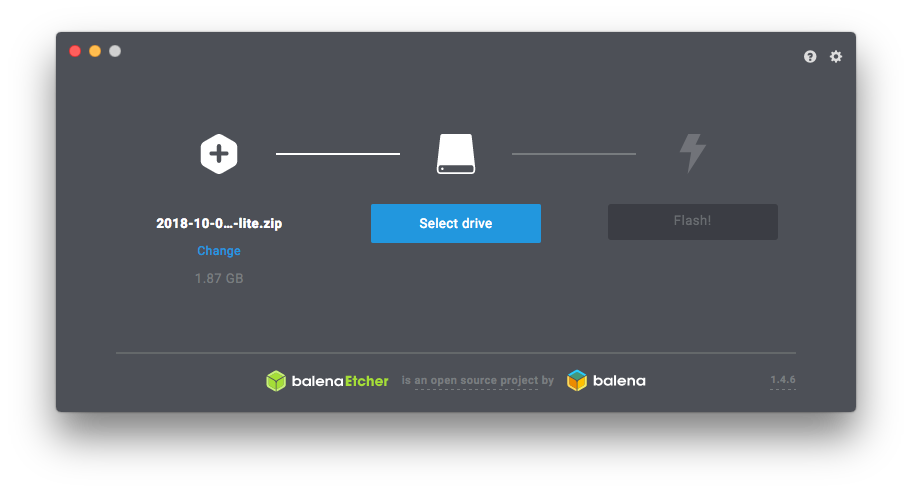
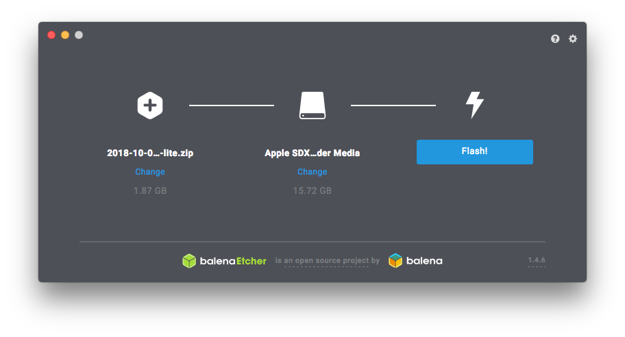
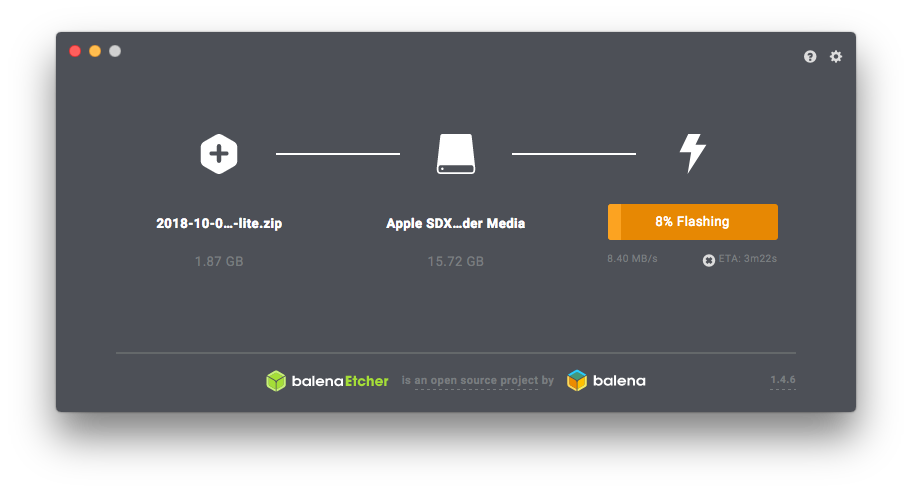
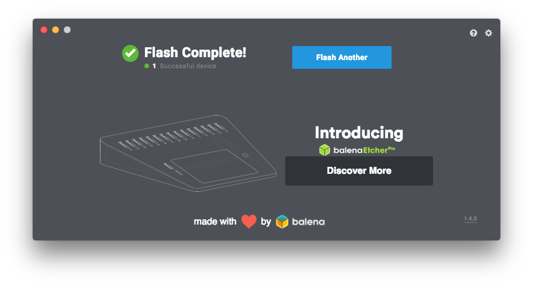

# Falshing SD CARD

## Requirements
[Etcher]()
[Raspbian]()

[Reference](https://www.raspberrypi.org/documentation/installation/installing-images/README.md)

## Process on macOS
1. Make sure to have all SD cards unpluged.
2. Start Etcher.
3. Select the .img or .zip 
4. Plug the SD Card.
5. Wait for Etcher to show the drive or select it.
6. Click on Flash.
7. Wait for the the Process to end.
   
## Process on macOS with Images
1. Make sure to have all SD cards unpluged.
2. Start Etcher.
3. Select the .img or .zip 
   
   
4. Plug the SD Card.
5. Wait for Etcher to show the drive or select it.
   
6. Click on Flash.
   
7. Wait for the the Process to end.
   