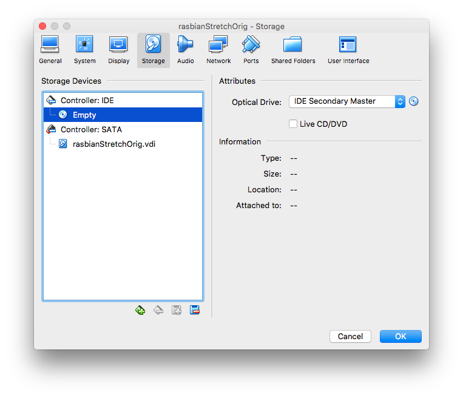

# Install Raspbian Stretch Desktop in VirtualBox

# ISO Download

[Download Page](https://www.raspberrypi.org/downloads/raspberry-pi-desktop/)
[Raspbian Desktop for MAC and PC](https://downloads.raspberrypi.org/rpd_x86_latest)

# Create a New Virtual Machine in VirtualBox

## Process without images.
1. Select New VM
2. Configure it as Follows:
   * **Name:** raspbianStretchOrig.
   * **Type:** Linux.
   * **Version:** Debian (32-bit).
3. Select at least 1[GB] RAM.
4. Create a Virtual Hard Disk Now.
5. VDI (VirtualBox Disk Image)
6. Dynamically Allocated
7. Size of the Disk **In my Case 8 [GB]**
8. Settings -> Storage Devices -> Load **iso image**
9.  Settings -> Network -> Bridged Network
10. Start

## Process with images.
1. Select New VM
2. Configure it as Follows:
   * **Name:** raspbianStretchOrig.
   * **Type:** Linux.
   * **Version:** Debian (32-bit).
   
3. Select at least 1[GB] RAM.
   
4. Create a Virtual Hard Disk Now.
   
5. VDI (VirtualBox Disk Image)
   
6. Dynamically Allocated
   
7. Size of the Disk **In my Case 8 [GB]**
   
8. Settings -> Storage Devices -> Load **iso image**
   
   
9.  Settings -> Network -> Bridged Network
   
11. Start
   

# Install Raspbian Stretch

## Process with images.
1. In the initial Boot, Select Install.

2. Select the Keyboard Layout. (For Mac in Mexico Select Spanish Layout)

3. Follow the defaults for partitioning.
   
   
   
   
   
4. Accept Grub Loader Installation
   
   
5. Finish Install
   

# Configure It

## Graphical Desktop

### Process without images
Once the system is rebooted.
1. Configure Localization.
2. Select Preferences Raspberry Pi Configuration.
3. Configure the System Settings
4. Enable SSH
5. Configure Localization.
6. Configure Timezone
7. Open the Terminal and Check for the IP address.

### Process with images
Once the system is rebooted.
1. Configure Localization.
   
   
2. Select Preferences Raspberry Pi Configuration.
   
3. Configure the System Settings
   
4. Enable SSH
   
5. Configure Localization.
   
6. Configure Timezone
   
7. Open the Terminal and Check for the IP address.
   

## Command Line

# Download VNC Viewer
[VNC](https://www.realvnc.com/en/connect/download/viewer/)