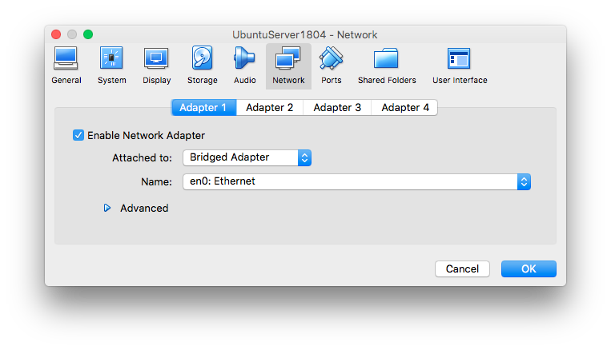
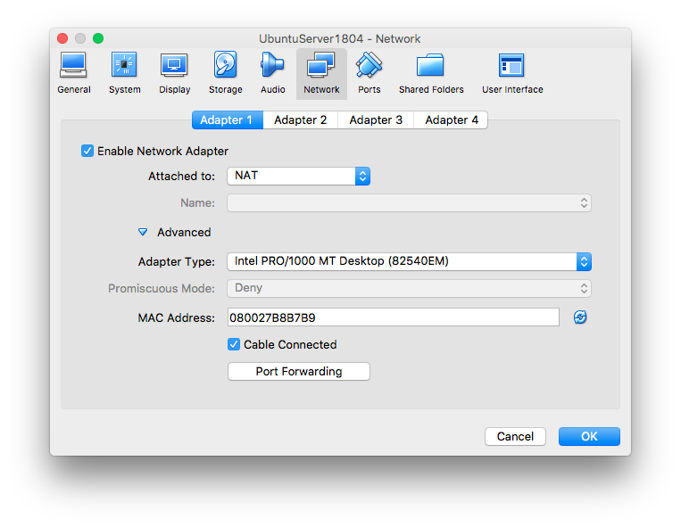
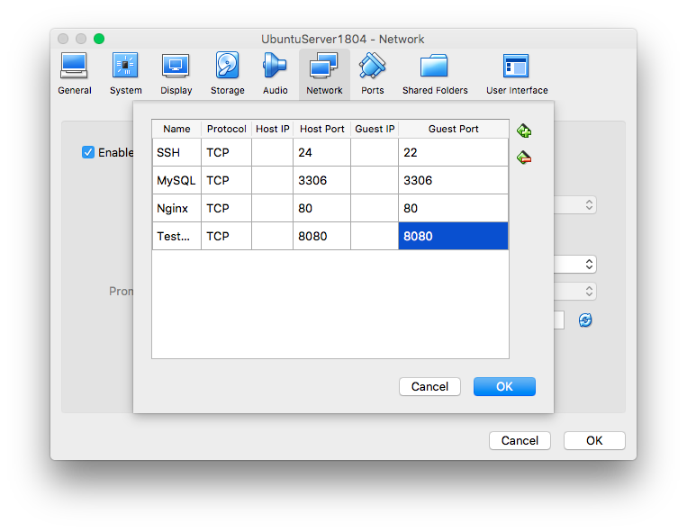

# Ubuntu Server 18.04 Installation NOTES <!-- omit in toc --> 

- [Download the Required Software.](#download-the-required-software)
- [VirtualBox Installation](#virtualbox-installation)
- [UBUNTU 1804 Server Installation](#ubuntu-1804-server-installation)
  - [VM Configuration](#vm-configuration)
  - [Ubuntu Installation](#ubuntu-installation)
  - [Ubuntu Customization](#ubuntu-customization)
    - [Install Language Package](#install-language-package)
    - [System Upgrade](#system-upgrade)
    - [SSH Configuration](#ssh-configuration)
      - [Bridged Configuration](#bridged-configuration)
        - [IP Config with NETPLAN](#ip-config-with-netplan)
      - [Port Forwarding Configuration](#port-forwarding-configuration)
    - [Create a new SUDO User for Application Administration](#create-a-new-sudo-user-for-application-administration)
    - [Virtual Box Guest Additions](#virtual-box-guest-additions)
  - [Share Folder](#share-folder)
- [Make the mount folder persistent (First Approach is not Working)](#make-the-mount-folder-persistent-first-approach-is-not-working)
- [Make Directory persistent with a Symbolic link](#make-directory-persistent-with-a-symbolic-link)
- [Ubuntu 18.04 Software Installation](#ubuntu-1804-software-installation)
  - [List Installed Packaged](#list-installed-packaged)
  - [MySQL](#mysql)
    - [Edit `/etc/mysql/mysql.conf.d/mysqld.cnf`](#edit-etcmysqlmysqlconfdmysqldcnf)
    - [Create A Remote User](#create-a-remote-user)
    - [Restart MySQL Service](#restart-mysql-service)
  - [PostgreSQL](#postgresql)
    - [Installation](#installation)
    - [Configuration](#configuration)
      - [Create Super User as postgres USER](#create-super-user-as-postgres-user)
      - [Create USER and ASSOCIATED DATABASE](#create-user-and-associated-database)
      - [RESTORE backup or tar](#restore-backup-or-tar)
  - [NGINX](#nginx)
    - [Installation](#installation-1)
    - [Configuration](#configuration-1)
  - [Python 3](#python-3)
  - [(Python) Virtualenv](#python-virtualenv)
  - [(Python) Virtualenvwrapper](#python-virtualenvwrapper)
    - [Configuration](#configuration-2)
  - [Supervisor](#supervisor)
  - [NodeJS](#nodejs)
  - [GIT](#git)
  - [Network Clock Sync](#network-clock-sync)
  - [Install Support Libraries for LDAP](#install-support-libraries-for-ldap)
  - [Install RabbitMQ](#install-rabbitmq)
  - [Install Redis](#install-redis)
- [Running the VM in the backplane](#running-the-vm-in-the-backplane)
- [Linux Command Reference](#linux-command-reference)
  - [Service Status](#service-status)
  - [List Listening Ports](#list-listening-ports)
  - [List Users](#list-users)
    - [Memory Usage](#memory-usage)
    - [MAC Address](#mac-address)

# Download the Required Software.
* [VirutalBox](https://www.virtualbox.org/wiki/Downloads)
* [Ubuntu Server 18.04](https://www.ubuntu.com/download/server)

# VirtualBox Installation

When Installing the dmg package there there is a problem at the very end of the installation which is preventing Virtual Box to complete the installation in macOS High Sierra.
> Virtual Box 5.2
> macOS High Sierra 10.13.6

[Failed Installation Issue Solved](https://stackoverflow.com/questions/46546192/virtualbox-not-installing-on-high-sierra)

> It's a Mac OS issue. Go to system preferences/Security & Privacy. There Allow Oracle to install software. Retry installing virtual box after that. It worked for me. Good Luck!

# UBUNTU 1804 Server Installation

## VM Configuration

* New VM
* Name the VM [UbuntuServer1804] / Linux / Ubuntu (64-bit)
* RAM Memory 2048
* Create a Virtual Hard Disk Now / VDI Select / Dynamically Allocated / 10 GB
* Start the VM
* Locate and Load the ISO File `UbuntuServer1804`

## Ubuntu Installation
* Language Selection
* Keyboard layout configuration / Keyboard Identification
* Start Installation (Install Ubuntu).
* Initial Network Config `Defaults`.
* Proxy Address `None`.
* Mirror Address `Default`.
* Partitioning `Default`.
* Disk Selection `Default`.
* File System Summary `No Action Required`.
* Login Configuration. *Make it Default as ubuntu / ubuntu / ubuntu*
* Server Snaps **Not Selected Any**
* Reboot

## Ubuntu Customization

### Install Language Package

```
sudo apt-get install language-pack-en
```

### System Upgrade
```bash
# Package Libraries Update
sudo apt-get update
# System Upgrade
sudo apt-get upgrade
# Turn the system down
sudo poweroff
```

### SSH Configuration

#### Bridged Configuration

* Configure VM Network to Bridged

* Restart
  
In Ubutnu Console type `ifconfig` , Verify the new IP Address is in your Network Segment.

In macOS Terminal ssh to the Virtual Machine
```console
ssh -p 22 ubuntu@192.168.1.79
```
##### IP Config with NETPLAN
[Reference](https://websiteforstudents.com/configure-static-ip-addresses-on-ubuntu-18-04-beta/)

```bash
# /etc/netplan/50-cloud-init.yaml
sudo vim /etc/netplan/50-cloud-init.yaml

# DHCP ORIGINAL CONFIG
network:
    ethernets:
        enp0s3:
            addresses: []
            dhcp4: true
    version: 2

# STATIC IP CONFIGURATION
network:
    ethernets:
        enp0s3:
            addresses: [192.168.1.240/24]
            gateway4: 192.168.1.254
            nameservers:
              addresses: [192.168.1.254,200.94.26.115,8.8.8.8,8.8.4.4]
            dhcp4: no
    version: 2

```

```console
sudo netplan apply
sudo netplan --debug apply
```
#### Port Forwarding Configuration

In order to Isolate the VM and use the same IP as our local machine we can use port forwarding in:
> Settings -> Network -> Advanced -> Attached to: NAT



> Click in Port Forwarding

Enable as follows:
* SSH in port 2200 **This way we avoid Port collision with our local host**
* MySQL in Port 3306
* PostgreSQl in Port 5432
* Nginx in Port 80
* TestWeb in Port 8080



**Login in via SSH from Host Computer** \
`ssh -p 2200 ubuntu@localhost`

>**Note:** Make sure you have the original netplan configuration.
```bash
# /etc/netplan/50-cloud-init.yaml
sudo vim /etc/netplan/50-cloud-init.yaml

# DHCP ORIGINAL CONFIG
network:
    ethernets:
        enp0s3:
            addresses: []
            dhcp4: true
    version: 2
```

### Create a new SUDO User for Application Administration

```
sudo adduser appsuser
sudo adduser appsuser sudo
```

### Virtual Box Guest Additions
> Menu -> Devices -> Insert Guess Additions CD Image

```bash
# Install Linux Headers required to compile
sudo apt install linux-headers-$(uname -r) build-essential dkms
# Reboot the System
sudo reboot
# Mount the virtual cd rom
sudo mkdir /media/cdrom/
sudo mount -t auto /dev/cdrom /media/cdrom/
# cd into the cdrom and install Guest Additions
cd /media/cdrom/
sudo sh ./VBoxLinuxAdditions.run
```
> Guest Additions are required if you want to share a Disk between the Host machine and the Guest machine.

## Share Folder

* Create a directory in the Host Machine
* Go to Settings in the Virtual Machine Menu
* Select the Created Directory to be shared
* Select: Automount and Unselect: Read only \
* Reboot the Virtual Machine (Guest Marchine)

* Verify the shared directory is being automounted and displayed
* In a Terminal Window (Guest Machine) create the shared direcotry
* In the Guest Machine edit the user .profile to mount the Shared Directory in the specified location


```bash
# Old Method

df -H
mkdir shared
sudo mount -t vboxsf [HOST_DIRECTORY] /home/[USERNAME]/[SHARED]
sudo mount -t vboxsf VMTraining /home/training/shared

vim .profile \
sudo mount -t vboxsf [HOST_DIRECTORY] /home/[USERNAME]/[SHARED]
:wq

source .profile \
cd shared
```

```bash
# New Method
# List the Directories
df -H
# Try to Cd into the Virtua Box Shared Directory
cd /media/vm-shared
# Add the user ubuntu to the vboxsf Group
# sudo usermod -a -G vboxsf <user>
sudo usermod -a -G vboxsf ubuntu
sudo usermod -a -G vboxsf [Application user]
# Reboot the VM and try Again
# Try to Cd into the Virtua Box Shared Directory
cd /media/sf_vm-shared/
# Create a soft Link
# ln -s [Source] [Link]
ln -s /media/sf_vm-shared/ myshared
```

# Make the mount folder persistent (First Approach is not Working)

This directory mount we just made is temporary and it will disappear on next reboot. To make this permanent, we'll set it so that it will mount our ~/shared directory on system startup

Edit fstab file in /etc directory
```
sudo vim /etc/fstab
```
Add the following line to fstab (separated by tabs) and press Ctrl+O to Save.
shared	/home/<username>/shared	vboxsf	defaults	0	0
vm-shared-1804	/home/<username>/apps	vboxsf	defaults	0	0

Edit modules
```
sudo vim /etc/modules
```
Add the following line to /etc/modules and save
vboxsf

# Make Directory persistent with a Symbolic link

```
ln -s [TARGET] [LINK]
```


(Reference)[https://gist.github.com/estorgio/1d679f962e8209f8a9232f7593683265#make-the-mount-folder-persistent]

# Ubuntu 18.04 Software Installation
## List Installed Packaged
```console
sudo apt list --installed
```

## MySQL
[Reference](https://www.digitalocean.com/community/tutorials/how-to-install-mysql-on-ubuntu-18-04)
```bash
sudo apt-get update
sudo apt-get install mysql-server
sudo apt-get install libmysqlclient-dev
sudo mysql_secure_installation
# Enable / Disable VALIDATE PASSWORD PLUGIN
# SET root Password
# Default all other options
```

### Edit `/etc/mysql/mysql.conf.d/mysqld.cnf`

```console
sudo vim /etc/mysql/mysql.conf.d/mysqld.cnf
```

```bash
# Change line 43
# From
bind-address            = 127.0.0.1
# To
bind-address            = 0.0.0.0
```

### Create A Remote User
```console
sudo mysql -u root -p
```

```sql
CREATE USER 'myroot'@'%' IDENTIFIED BY 'myroot';

GRANT ALL PRIVILEGES ON *.* TO 'myroot'@'%' WITH GRANT OPTION;

-- ALTER USER 'root'@'%' IDENTIFIED BY 'MyNewPass';

```

[Reference for Problem Access Denied](https://stackoverflow.com/questions/39281594/error-1698-28000-access-denied-for-user-rootlocalhost)
[Reference to Create a Remote User](https://stackoverflow.com/questions/16287559/mysql-adding-user-for-remote-access)

### Restart MySQL Service

```bash
# Check MySql status
sudo service mysql status
# restart MySql Service
sudo service mysql restart
```

## PostgreSQL

[Reference](https://www.digitalocean.com/community/tutorials/how-to-install-and-use-postgresql-on-ubuntu-18-04)
### Installation
```console
sudo apt update
sudo apt install postgresql postgresql-contrib
<!-- Install psycopg2 -->
sudo apt-get install python-psycopg2
```
### Configuration

```bash
# Edit pstgresql.conf file usually found in /etc.
sudo vim /etc/postgresql/10/main/postgresql.conf 
# vim command -> : set number
# change line 59 
# listen_addresses = 'localhost' -> listen_addresses = '*'

sudo vim /etc/postgresql/10/main/pg_hba.conf
# Add At the end
# Allow Remote Connections
host    all             all             0.0.0.0/0               md5
host    all             all             ::/0                    md5


sudo service postgresql restart
```

#### Create Super User as postgres USER

[Reference1](https://tableplus.io/blog/2018/10/how-to-create-superuser-in-postgresql.html)

[Reference2](https://support.chartio.com/knowledgebase/creating-a-user-with-p)

```console
sudo -u postgres psql
```

```sql
CREATE ROLE pgremote SUPERUSER LOGIN CREATEROLE CREATEDB REPLICATION BYPASSRLS;
ALTER ROLE pgremote WITH PASSWORD '[password]';
```

#### Create USER and ASSOCIATED DATABASE

```sql
CREATE ROLE [USER-NAME] LOGIN PASSWORD '[password]';
CREATE DATABASE [DB-NAME] WITH OWNER=[USER-NAME];

-- Example
CREATE ROLE test LOGIN PASSWORD '1234';
CREATE DATABASE mytest WITH OWNER=test;

```

#### RESTORE backup or tar

The following example is done with dvdrental.tar database example.

```bash
# Create the database in psql
sudo -u postgres psql
# or
psql -h localhost -U [USER] [DATABASE]

CREATE DATABASE [DATABASE];
\q

# Database
pg_restore -h localhost -U [USER] -d [DATABASE] -v [FILE_PATH]
# Example
pg_restore -h localhost -U pgremote -d dvdrental -v "/home/ubuntu/dvdrental.tar"

```


## NGINX

### Installation

```
sudo apt-get update
sudo apt-get install nginx
```

### Configuration

```
sudo vim /etc/nginx/sites-enabled/default
```

```bash
# Example of Configuration

# [appication_name] Project Directives Section
        location /[appication_name]/static/ {
                alias  /home/user/apps_directory/[appication_name]/static/;
#           autoindex on;
        }
        location /[appication_name]/media/ {
                alias  /home/user/media_directory/[appication_name]/;
#           autoindex on;
        }
        location /[appication_name]/ {
                proxy_set_header SCRIPT_NAME /[appication_name];
                proxy_pass http://127.0.0.1:8008;
                proxy_set_header Host $host;
        }

```


```
sudo service nginx reload
```

## Python 3
Python3 is already Installed in Ubuntu 18.04 but [pip3](https://linuxize.com/post/how-to-install-pip-on-ubuntu-18.04/) is not.

Verify the Repositories are enabled
```console
sudo add-apt-repository main
sudo add-apt-repository universe
sudo add-apt-repository restricted
sudo add-apt-repository multiverse
```
Install it
```console
sudo apt-get install python3
sudo apt install python3-pip
pip3 install --upgrade pip
```

[Issue Solved](https://askubuntu.com/questions/378558/unable-to-locate-package-while-trying-to-install-packages-with-apt)

## (Python) Virtualenv
```console
pip3 install --upgrade pip
pip3 install --user virtualenv
```
## (Python) Virtualenvwrapper
```console
pip3 install --upgrade pip
pip3 install --user virtualenvwrapper
```
### Configuration
* Locate the virtualenvwrapper path.  `sudo find / -name virtualenvwrapper.sh`
* Edit the `virtualenvwrapper.sh` script.
```bash
# vim virtualenvwrapper.sh
# set number
#
# Change the script line 
# from
50     VIRTUALENVWRAPPER_PYTHON="$(command \which python)"
# to
50     VIRTUALENVWRAPPER_PYTHON="$(command \which python3)"
```
* Edit `~/.profile`
```bash
# VIRTUALENVWRAPPER CONFIGURATION
# Update with the location of the virtualenvwrapper.sh Path.
VIRTUALENVWRAPPER_SH_PATH=""
# set where virutal environments will live
export WORKON_HOME=$HOME/.virtualenvs
# ensure all new environments are isolated from the site-packages directory
export VIRTUALENVWRAPPER_VIRTUALENV_ARGS='--no-site-packages'
# use the same directory for virtualenvs as virtualenvwrapper
export PIP_VIRTUALENV_BASE=$WORKON_HOME
# makes pip detect an active virtualenv and install to it
export PIP_RESPECT_VIRTUALENV=true
if [[ -r ${VIRTUALENVWRAPPER_SH_PATH} ]]; then
    source ${VIRTUALENVWRAPPER_SH_PATH}
else
    echo "WARNING: Can't find virtualenvwrapper.sh"
fi
```

## Supervisor

```
sudo apt-get install supervisor
```

## NodeJS

Check for the latest LTS Version and Update the commands shown below.

[Reference Article](https://websiteforstudents.com/install-the-latest-node-js-and-nmp-packages-on-ubuntu-16-04-18-04-lts/)

[Node Source](https://github.com/nodesource/distributions/blob/master/README.md#debinstall)

```bash

# Using Ubuntu
curl -sL https://deb.nodesource.com/setup_10.x | sudo -E bash -
sudo apt-get install -y nodejs
```

[NodeJS in Production with NGINX](https://www.moveoapps.com/blog/set-node-js-application-production-nginx-reverse-proxy/)

## GIT
GIT is already Installed in Ubuntu 18.04
``` console
sudo apt-get install git
```
 Add the following lines to `~/.profile` This way you can view the branch in the prompt.
```bash
# Git branch in prompt.
parse_git_branch() {
  git branch 2> /dev/null | sed -e '/^[^*]/d' -e 's/* \(.*\)/ (\1)/'
}
export PS1="\u@\h \W\[\033[32m\]\$(parse_git_branch)\[\033[00m\] $ "

```

## Network Clock Sync

[Reference Digital Ocean Ubuntu 16.04](https://www.digitalocean.com/community/tutorials/how-to-set-up-time-synchronization-on-ubuntu-16-04)
[Reference Ubuntu Docs](https://help.ubuntu.com/lts/serverguide/NTP.html.en)

```bash
# Check if Date/Time is correct
date
# Check System time status
timedatectl status
# Check time-zones
timedatectl list-timezones
timedatectl list-timezones | grep Mexico
# Set the Time Zone
sudo timedatectl set-timezone America/Mexico_City
# rolling back to UTC or Etc/UTC in the Time Zone
# sudo timedatectl set-timezone Etc/UTC
# Check System time status
timedatectl status
# Check if Date/Time is now correct
date

```

## Install Support Libraries for LDAP

```
sudo apt-get install libldap2-dev
sudo apt-get install libsasl2-dev
```

## Install RabbitMQ

```

```

(Installation)[https://www.techulator.com/resources/18003-How-to-deploy-a-RabbitMQ-server-on-Ubuntu-1804-Bionic-Beaver.aspx]


## Install Redis

# Running the VM in the backplane
```bash
#!/bin/bash
# This script is to be executed in the HOst Machine in this case macOS
# VBoxHeadless --startvm "vm_name" &
VBoxHeadless --startvm "UbuntuServer1804" &
```

# Linux Command Reference
## Service Status
```bash
# Service Status Check
sudo service [srv_name] status
# Service Stop
sudo service [srv_name] stop
# Service Start
sudo service [srv_name] start
# Service Restart
sudo service restart
```
## List Listening Ports

[Reference](https://support.rackspace.com/how-to/checking-listening-ports-with-netstat/)

```console
sudo netstat -tulpn

sudo netstat -plnt

sudo netstat -plnt | grep ':80'
```

## List Users
```bash
sudo cat /etc/passwd
```

### Memory Usage
[Reference](https://www.binarytides.com/linux-command-check-memory-usage/)
```bash
free -m

cat /proc/meminfo

vmstat -s
```

### MAC Address
```bash
# cat /sys/class/net/[interface]]/address
cat /sys/class/net/enp0s3/address

ifconfig -a | grep -Po 'HWaddr \K.*$'
```

[Reference](https://askubuntu.com/questions/628383/output-only-mac-address-on-ubuntu)